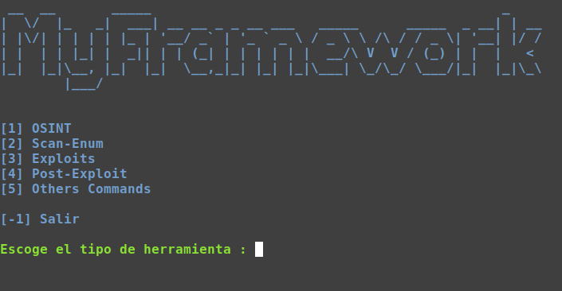
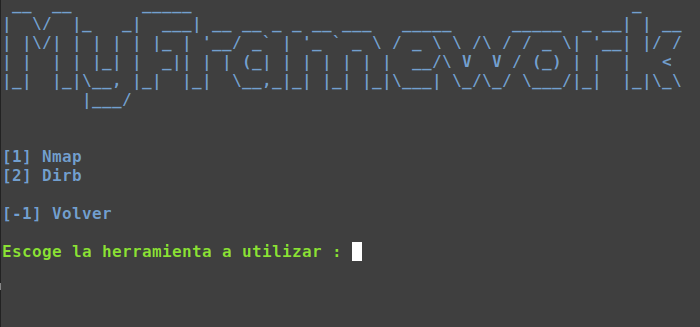

# FrameworkCreator
### Descripción
MyFrameWorkCreator es un script que permite crear nuestro propio entorno de trabajo (Framework) a partir de un archivo XML con un formato determinado.
### Uso
1. Se crea un fichero XML con el formato que tiene el archivo tools.xml
2. Se ejecuta el script MyFrameworkName.py con python3
    ~~~
    python3 MyFrameworkName.py
    ~~~

### Opciones
~~~sh
-r , --recheck Flag que indica al script que debe ejecutar los comandos aunque se encuentren en la BBDD (CUIDADO, borra los datos anteriores)
-t table_name , --table table_name Nombre de la tabla que guardará los datos de los comandos ejecutados (por defecto testing)
~~~
### Features
- Automatización de un conjunto de comandos
- Generación de informe/dashboard a partir de la bbdd
