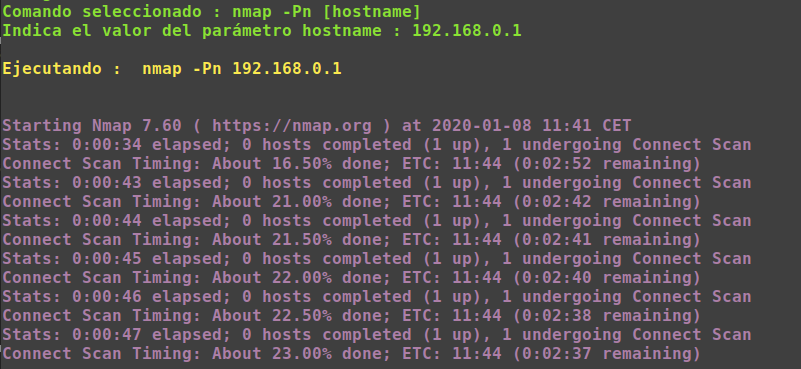

# FrameworkCreator
### Descripción
MyFrameWorkCreator es un script que permite crear nuestro propio entorno de trabajo (Framework) a partir de un archivo XML con un formato determinado.
### Uso
1. Se crea un fichero XML con el formato que tiene el archivo tools.xml
2. Se ejecuta el script MyFrameworkName.py con python3
    ~~~
    python3 MyFrameworkName.py
    ~~~

### Opciones
~~~sh
-r , --recheck  #Flag que fuerza ejecutar los comandos aunque se encuentren en la BBDD (CUIDADO, borra los datos anteriores)
-t table_name , --table table_name  #Tabla que guardará los datos de los comandos ejecutados (por defecto testing)
-c config_file, --config_file   #Fichero que asigna valors por defecto a los parámetros
~~~
### Features
[x] BBDD
[x] Archivo para almacenar el valor de los parámetros por defecto (conf.txt)
[x] Creación automática de Banner a partir del nombre
[x] Automatización de un conjunto de comandos
[ ] Generación de informe/dashboard a partir de la bbdd
